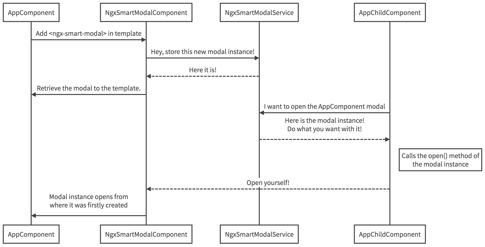

# ngx-smart-modal
[](https://travis-ci.org/maximelafarie/ngx-smart-modal) [](https://badge.fury.io/js/ngx-smart-modal) [](https://npmjs.org/ngx-smart-modal)

`ngx-smart-modal` is a lightweight and very complete Angular component for managing modal through any Angular project. It was built for modern browsers using TypeScript, SCSS, HTML5 and Angular >=4.0.0.

## No external library, no jQuery! 🤘
To avoid imposing you to download a CSS library by using this package, this one is only using [Angular animations](https://angular.io/guide/animations). So get rid off to be forced to use a CSS library you don't want to! In addition, it doesn't use jQuery too! 

> #### But... I'm using Boostrap (or Matrialize, Foundation or anything else)!
> Don't panic! We already thought about that! And because we want to be the more neutral as we can, we made it very flexible for you to style it!
> So if your app uses a CSS framework that has some modal styles, you simply have to pick up its class names and set the main class it in the `[customClasses]="modal"` (e.g.: bootstrap). And the rest of the modal DOM elements simply have to be set in the `ngx-smart-modal` component (e.g.: modal-dialog, modal-content, modal-header, etc.).

Check out the [documentation](https://github.com/maximelafarie/ngx-smart-modal) & [demos](https://github.com/maximelafarie/ngx-smart-modal) for more information and tutorials!

See the [changelog](https://github.com/maximelafarie/ngx-smart-modalchangelog.md) for recent changes.

## Features
 - Handle large quantity of modals anywhere in your app
 - Customize the style of your modals through custom CSS classes
 - No external CSS library is used so you can easily override the modals default style
 - Pass data to any modal, and retrieve it very simply in the modal view
 - Events on `open`, `close` and `dismiss` for each modal
 - Manage all your modal stack and data with very fast methods
 - Very smart `z-index` computation (no ugly glitches or problems with a modal inside another)
 - A modal in a modal in a modal in a modal... I guess you got it!
 - AoT compilation support

## Setup
To use `ngx-smart-modal` in your project install it via [npm](https://www.npmjs.com/package/ngx-smart-modal):
```
npm i ngx-smart-modal --save
```
Then add `NgxSmartModalModule` and `NgxSmartModalService` to your project `NgModule`
```
import {BrowserModule} from '@angular/platform-browser';
import {NgModule, CUSTOM_ELEMENTS_SCHEMA} from '@angular/core';

import {AppComponent} from './app.component';
import {NgxSmartModalModule, NgxSmartModalService} from 'ngx-smart-modal';

@NgModule({
  declarations: [
    AppComponent,
  ],
  imports: [
    BrowserModule,
    NgxSmartModalModule
  ],
  providers: [NgxSmartModalService],
  schemas: [CUSTOM_ELEMENTS_SCHEMA],
  bootstrap: [AppComponent]
})
export class AppModule {
}
```

## Manipulate modals
You can use it directly in your component's template like this
```
<ngx-smart-modal #myModal [identifier]="'myModal'">
  <h1>Title</h1>
  <p>Some stuff...</p>

  <button (click)="myModal.close()">Close</button>
</ngx-smart-modal>
```
At this point, the modal instance is stored in the `NgxSmartModalService`. You can do absolutely what you want with it, anywhere in your app. For example, from a component :
```
import {Component} from '@angular/core';
import {NgxSmartModalService} from 'ngx-smart-modal';

@Component({
  ...
})
export class AppComponent {
  constructor(public ngxSmartModalService: NgxSmartModalService) {
  }
}
```
Then in the AppComponent view you can open any modal with no need to be in the same view:
```
<button (click)="ngxSmartModalService.getModal('myModal').open()">Open myModal</button>
```

## Manipulate data
You can associate data with any created modal. To do that, simply use the `setModalData()` from the `NgxSmartModalService`:
```
import {AfterViewInit, Component} from '@angular/core';
import {NgxSmartModalService} from 'ngx-smart-modal';

@Component({
  ...
})
export class AppComponent implements AfterViewInit {
  constructor(public ngxSmartModalService: NgxSmartModalService) {
  }

  ngAfterViewInit() {
    const obj: Object = {
      prop1: 'test',
      prop2: true,
      prop3: [{a: 'a', b: 'b'}, {c: 'c', d: 'd'}],
      prop4: 327652175423
    };

    this.ngxSmartModalService.setModalData(obj, 'myModal');
  }
}
```
After that, you can retrieve the modal data directly from the view with the `getData()` modal property. To avoid any errors with unavailable data, you can use the `hasData()` modal property (It's dynamic. If data comes after a certain time its value will automatically change to `true`):
```
<ngx-smart-modal #myModal [identifier]="'myModal'">
  <div *ngIf="myModal.hasData()">
    <pre>{{ myModal.getData() | json }}</pre>
  </div>

  <button (click)="myModal.close()">Close</button>
</ngx-smart-modal>
```

## Handle events
`ngx-smart-modal` comes with three built-in events: `onOpen`, `onClose` and `onDismiss`.

 - `onOpen`: a modal has been opened
 - `onClose`: a modal has been closed
 - `onDismiss`: a modal has been closed by clicking on its backdrop

You can handle events directly from the view...
```
<ngx-smart-modal #myModal [identifier]="'myModal'" (onOpen)="log('Modal opened!')" (onClose)="log('Modal closed!')" (onDismiss)="log('Modal dismissed!')">
  <h1>Title</h1>
  <p>Some stuff...</p>

  <button (click)="myModal.close()">Close</button>
</ngx-smart-modal>
```
...and execute component's functions:
```
@Component({
  ...
})
export class AppComponent {
  constructor() {
  }

  public log(msg: string) {
    console.log(msg);
  }
```

### How it works
Basically, imagine that the component is based on a service that stores any modals you create in order to let you pick them up and manage them anywhere in your app at any time.


